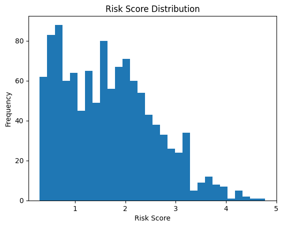

# Medicare Risk Adjustment Model

A Python project that replicates the core logic of Medicare's HCC (Hierarchical Condition Category) risk adjustment system using synthetic patient data. It maps patient diagnoses to HCC flags, computes a composite risk score, and builds linear regression models to predict individual healthcare expenses — comparing a demographics-only baseline against a full risk-adjusted model.

## What it does

Medicare Advantage plans are paid a risk-adjusted premium for each enrollee. The adjustment is based on the patient's HCC risk score — a weighted sum of their demographic characteristics and chronic condition flags. This project builds that scoring system from scratch and tests whether it improves prediction of actual healthcare expenses compared to a demographics-only model.

## Data

Uses **Synthea** synthetic patient records — two CSV files:

| File | Contents |
|------|----------|
| `patients.csv` | Demographics: date of birth, gender, race, healthcare expenses, coverage |
| `conditions.csv` | Diagnosis history: patient ID, condition description |

1,153 patients after filtering for valid ages (reference year: 2020).

## Pipeline

### 1. Feature Engineering

**Demographics:**
- `AGE` — derived from birth date relative to reference year 2020
- `MALE` — binary gender flag (1 = male, 0 = female)

**HCC Flags** — keyword-matched from condition descriptions:

| HCC Flag | Conditions Matched | Patients Flagged |
|----------|--------------------|-----------------|
| `HCC_DIABETES` | diabetes | 364 |
| `HCC_CARDIO` | heart, cardiac, hypertension | 392 |
| `HCC_RESP` | asthma, COPD, respiratory | 44 |
| `HCC_CANCER` | cancer | 27 |
| `HCC_RENAL` | renal | 32 |

### 2. Risk Score Calculation

A composite risk score is computed per patient using actuarially calibrated weights:

```
RISK_SCORE = 0.30
           + 0.02 × AGE
           + 0.10 × MALE
           + 0.50 × HCC_DIABETES
           + 0.70 × HCC_CARDIO
           + 0.40 × HCC_RESP
           + 0.80 × HCC_CANCER
           + 0.60 × HCC_RENAL
```

Higher weights reflect greater expected cost burden. Cancer carries the highest HCC weight (0.80), followed by cardiovascular disease (0.70) and renal disease (0.60).

**Risk score distribution**



> The distribution is right-skewed, as expected in a real insurance population — the majority of patients have low risk scores (0.3–1.5) representing healthy individuals, with a long tail of high-risk patients scoring above 3.0. The minimum score of 0.30 is the demographic baseline for a young female with no HCC flags. The maximum of 4.78 represents an older male with multiple chronic conditions. Mean risk score: **1.67**, median: **1.60**.

### 3. Model Comparison — Predicting Healthcare Expenses

Two Linear Regression models are trained on 80% of the data and evaluated on the held-out 20%:

| Model | Features | R² (raw expenses) | R² (log expenses) |
|-------|----------|-------------------|-------------------|
| **Basic** | Age, Gender | 0.435 | 0.485 |
| **Full** | Age, Gender, 5 HCC flags, Risk Score | 0.482 | 0.498 |

Adding HCC flags and the risk score improves R² by ~5 percentage points. The log-transformed target (using `log1p`) consistently improves both models, confirming that healthcare expenses follow a log-normal distribution — a standard assumption in actuarial cost modelling.

### 4. Feature Importance (Full Model — Log Expenses)

Coefficients from the full model on log-transformed expenses:

| Feature | Coefficient | Interpretation |
|---------|-------------|----------------|
| `HCC_RESP` | +0.169 | Respiratory conditions are the strongest cost driver per flag |
| `HCC_DIABETES` | +0.135 | Diabetes adds ~13.5% to expected log-cost |
| `HCC_CARDIO` | +0.086 | Cardiovascular disease adds ~8.6% |
| `RISK_SCORE` | +0.079 | Composite score adds incremental predictive value |
| `HCC_CANCER` | +0.033 | Smaller coefficient — cancer patients may be in remission |
| `AGE` | +0.024 | Each additional year adds ~2.4% to log-cost |
| `HCC_RENAL` | −0.175 | Negative — likely a data artefact from the synthetic dataset |
| `MALE` | −0.378 | Males have lower predicted expenses in this synthetic cohort |

> Note: The negative coefficients for `HCC_RENAL` and `MALE` are worth flagging. In a real Medicare population, renal disease is a high-cost condition and the coefficient would be expected to be positive. This likely reflects the small sample size of renal patients (n=32) in the synthetic dataset, causing the model to overfit to noise. In production, HCC weights would be calibrated on millions of actual CMS claims.

## Key results

| Metric | Value |
|--------|-------|
| Total patients | 1,153 |
| Most common HCC | Cardiovascular (392 patients, 34%) |
| Mean risk score | 1.67 |
| Risk score range | 0.30 – 4.78 |
| Basic model R² | 0.435 |
| Full model R² | 0.482 |
| Full model R² (log) | 0.498 |
| Top cost predictor | HCC_RESP (+0.169) |

## Setup

**Requirements:** Python 3.9+

```bash
pip install pandas numpy matplotlib scikit-learn
```

**Run in Colab:** Open `Medicare_Risk_Adjustment.ipynb` in [Google Colab](https://colab.research.google.com) and upload `patients.csv` and `conditions.csv` when prompted.

**Data:** Generate synthetic patient data using [Synthea](https://github.com/synthetichealth/synthea) or use any CMS-format claims extract.
